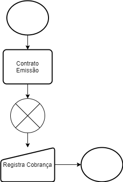
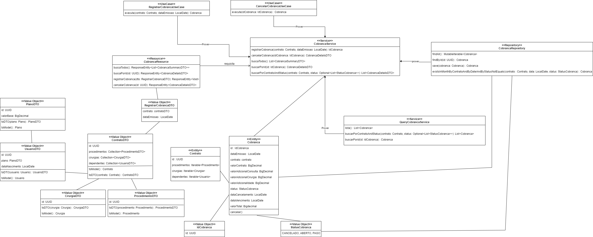
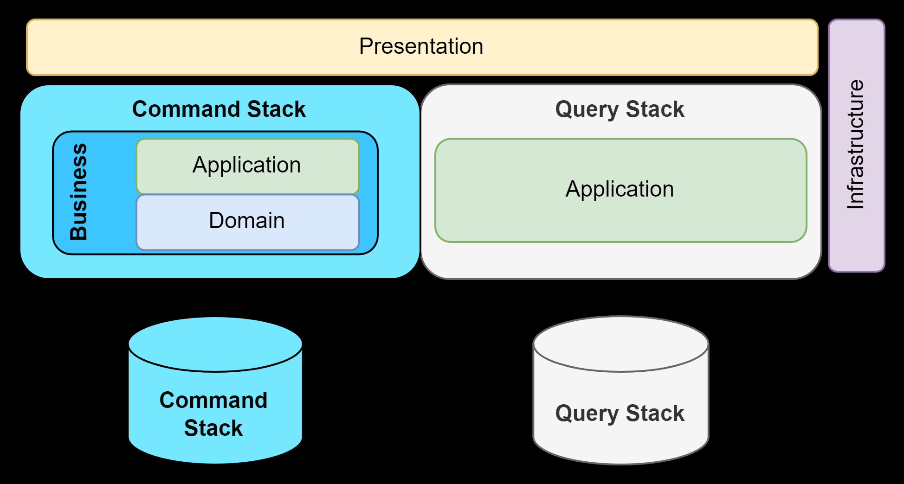
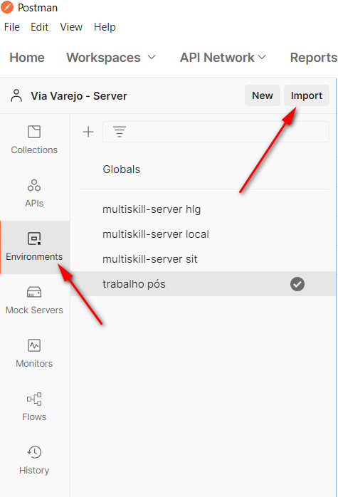
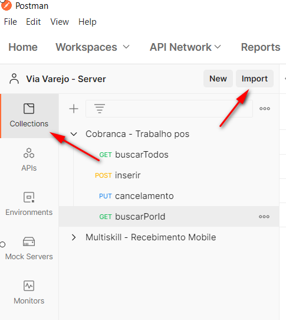
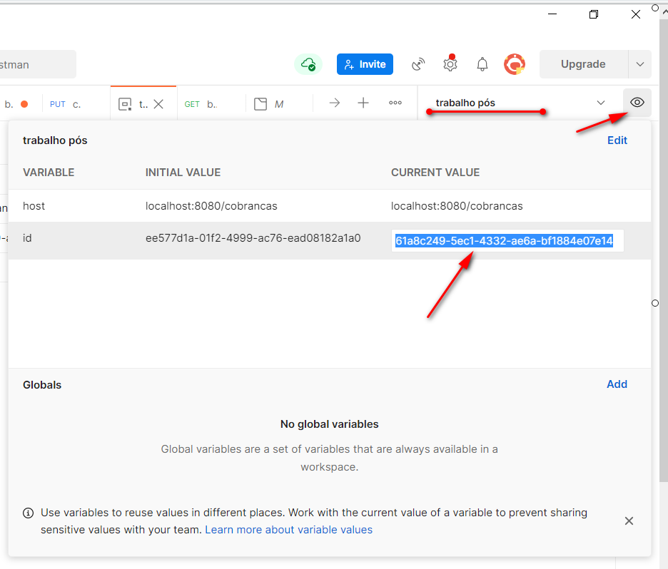

# Rotina de Cobranças

## Descrição

O objetivo dessa rotina é garantir o registro e o cancelamento de cobranças de contratos de planos de saúde.

## Glossário

**Contrato:** Vínculo envolvendo o titular, o plano e seus dependentes.

**Cobrança:** Documento de Ordem de Pagamento do títular com a empresa contratada, com base nos serviços
prestados/usufruídos.

## Modelos

### Processo de Registrar Cobrança

### Processo de Cancelar Cobrança

### Modelo de domínio detalhado

### Modelo de Arquitetura CQRS para rotina de Cobrança

-----------------------

### Setup Inicial

Utilize o [Environment](cobranca.postman_environment.json) do POSTMAN e
use a opção de Importar.

Utilize a [Collection](cobranca.postman_collection.json) do POSTMAN e
use a opção de Importar.

Após importado, você poderá utilizar as rotinas de cobrança normalmente.

**Atenção!**

As rotinas de ***cancelamento*** e ***buscaPorId*** utilizam o ID da cobrança a partir do environment, lembre-se de
atualizar essa variável para o ID da cobrança que você quer manipular.

